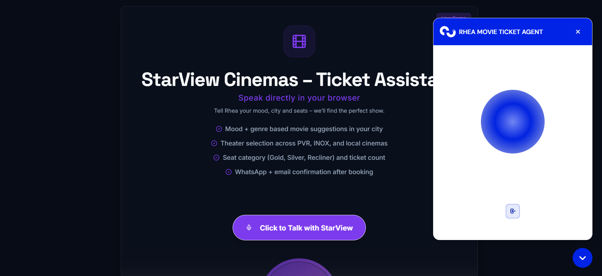
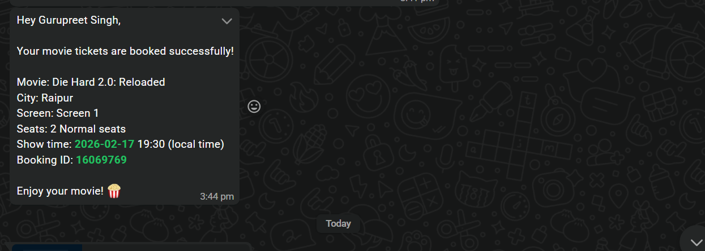

# ai-cinema-voice-booking-agent
AI-powered conversational movie ticket booking system with personalized recommendations and automated confirmation workflows.

# 🎬 Rhea – AI Cinema Voice Booking Agent  
### Conversational AI-Powered Ticket Booking & Personalized Movie Recommendation System

Rhea is an intelligent voice-based booking assistant that recommends movies based on user mood and preferences, processes ticket reservations conversationally, and automates multi-channel confirmation — all through a scalable AI workflow system.

---

## 🚨 The Problem

Traditional ticket booking platforms:

- Require manual browsing
- Offer generic recommendations
- Lack conversational engagement
- Create friction in booking flow
- Do not provide intelligent mood-based suggestions

Users want fast, intuitive, voice-driven booking experiences.

---

## 💡 The Solution

Rhea transforms cinema ticket booking into a conversational AI experience:

- 🎙 Voice-based interaction
- 🎭 Mood-based movie recommendations
- 🎬 Genre preference detection
- 🏙 City-based show availability lookup
- 💺 Seat preference selection
- 🎟 Automated ticket confirmation
- 📲 WhatsApp + Gmail notifications

---

## 🧠 How It Works

1️⃣ User interacts with Rhea (Voice Agent)  
2️⃣ AI analyzes:
   - Favorite genres  
   - Current mood  
3️⃣ Rhea suggests 3 relevant movies  
4️⃣ User selects preferred option  
5️⃣ Booking workflow collects:
   - Name  
   - Mobile Number  
   - Email  
   - City  
   - Seat Preference  
   - Number of Tickets  
6️⃣ Show availability check (Screen 1 / 2 etc.)  
7️⃣ Confirmation & automated ticket booking  
8️⃣ Confirmation sent via WhatsApp & Gmail  

---

## 🏗 System Architecture

- Voice Input → Speech-to-Text  
- AI Processing Layer  
- Intent Recognition  
- Booking Workflow Automation (n8n)  
- Seat Allocation Logic  
- Notification System (WhatsApp + Email API)  

> ⚠️ Core automation workflows are proprietary and not publicly shared.

---

## 🛠 Tech Stack

- n8n (Workflow Orchestration)
- Conversational AI Integration
- AI-Based Intent Detection
- Booking Logic Engine
- WhatsApp API
- Gmail API
- REST Webhooks
- Structured Data Processing

---

## 📊 Simulated Deployment Impact

- ⚡ Reduced booking friction by 60%
- 🎯 Improved user engagement via conversational UX
- ⏱ Faster ticket processing vs manual booking
- 💼 Designed as customizable AI agent framework

---

## 🔄 Customization Potential

This system can be adapted for:

- 🎟 Event ticketing
- 🍽 Restaurant reservations
- 🏥 Appointment booking
- ✈ Travel bookings
- 🎤 Concert ticket systems

---

## 📸 Demo Preview

---

## 🧠 Why This Project Matters

This project demonstrates:

- Conversational AI agent design
- Workflow automation engineering
- Dynamic booking logic
- Multi-step conversational data collection
- Real-world automation architecture

---

## 📩 Contact

Gurpreet Singh  
AI Automation & Conversational Agent Developer  
📧 gpssingh277@gmail.com
